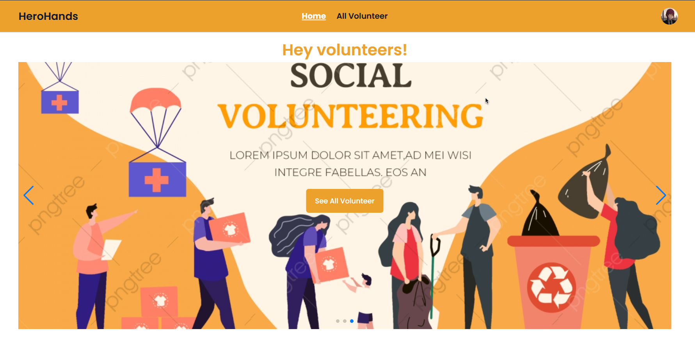

# Chill-Game-Website

Here i make a MERN stack project. Basically this is a volunteer management system website.User can register and sign in with their account. User can post any volunteer need post. User can search by the title and more more! This is a user friendly website. 

## Website-view

## Live-Link

[Volunteer-management-system](https://job-portal-website-1eda1.web.app/)

## Uses Technologies 

- ReactJS
- Tailwind
- DaisyUI
- Reat Toastify
- Reat Proptypes
- react icon
and  Many More

## 3 key features 

- Login,Registration 
- View all volunteer need post
- Add volunteer need post
- Delete volunteer need post
- Edit volunteer need post
- View details
- Search by title
- Be a volunteer request
